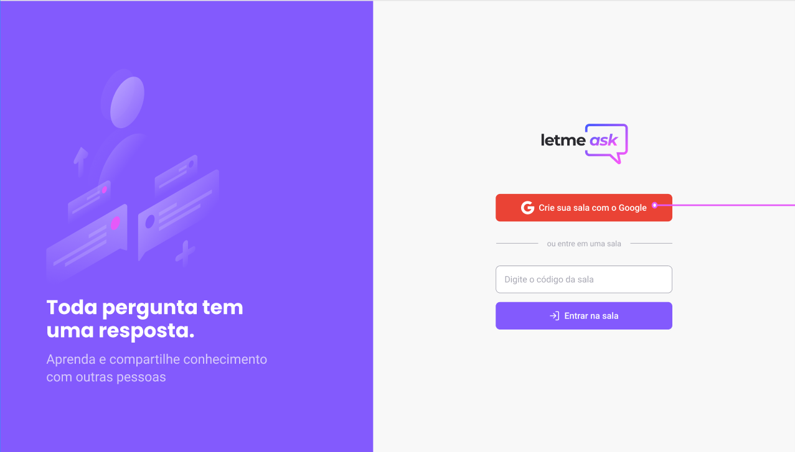

<h1 align='center'>
    
<h1>

<p align='center'>
  

  
  
  <a href='https://github.com/olimpiossdx/nlw-together/commits/master'>
    
  </a>

  <a href='https://github.com/olimpiossdx/olimpiossdx/nlw-together/issues'>
    
  </a>

  
</p>

  

## Sobre o projeto
<p>
 Aplicação <strong>letmeaks</strong>, um chat em tempo real, apresentando postagem de perguntas. Com isso é possível votar nas perguntas enviadas, o administrador da sala pode ir avaliando as perguntas pelo seu critério ou pela quantidade de 'curtidas' na pergunta e assim podendo marca-lá como respondida. Outra funcionalidade é a possíbilidade de remoção de perguntas pelo administrador.
</p>

---

## 🧪  Tecnologias
 Projeto desenolvido durante [nextlevelweek](https://nextlevelweek.com) com as seguintes tecnologias:

- [ReactJS](https://reactjs.org/) 
- [Typescript](https://www.typescriptlang.org/)
- [React-Router-Dom](https://github.com/ReactTraining/react-router) 
- [Firebase](https://console.firebase.google.com/) 
- [Figma](https://www.figma.com/file/NPKKPWcUAK67lBooW0Nd4b/Letmeask-(Copy)?node-id=45%3A3279) 

Ainda foi incrementado no projeto, algumas dicas apresentandas durante as aulas, utilização de toast (notificação) e modal para confirmação na funcionalidade de remoção de perguntas pelo administrador.
---
## 🚀 Iniciando

Clone este projeto e acesse a pasta.

```bash
$ git clone https://github.com/olimpiossdx/nlw-together
$ cd nlw-together
```

Siga os passos abaixo:
```bash
# Instale as dependências
$ yarn

# Inicie o projeto
$ yarn start
```
O aplicativo iniciará no seu navegador em http://localhost:3000

 ---


## 📝 Licença

Este projeto está sob a licença do MIT . Veja mais informações em [LICENSE](https://github.com/marssaljr/letmeask/blob/master/LICENSE).

---